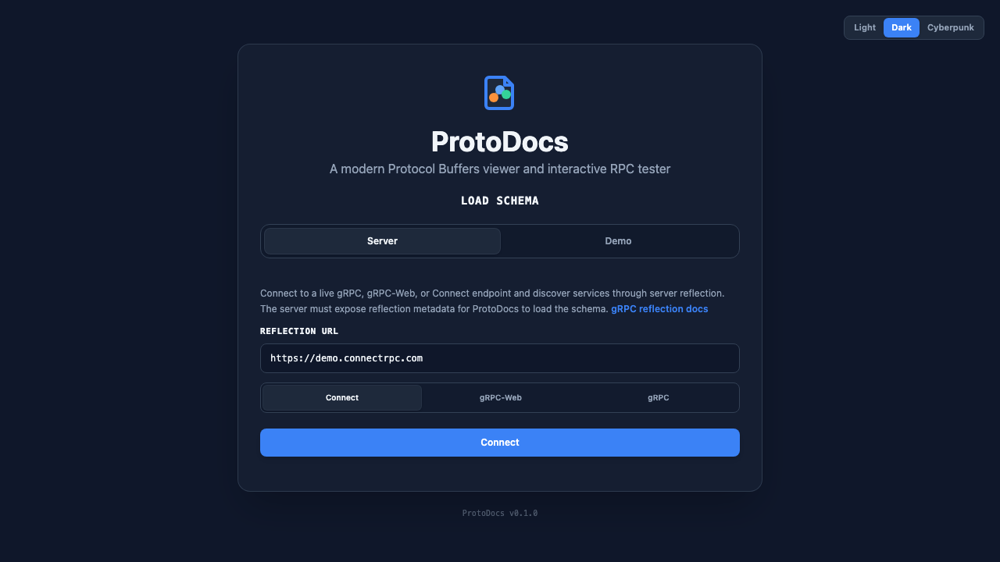
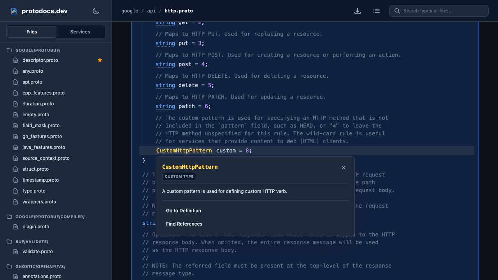
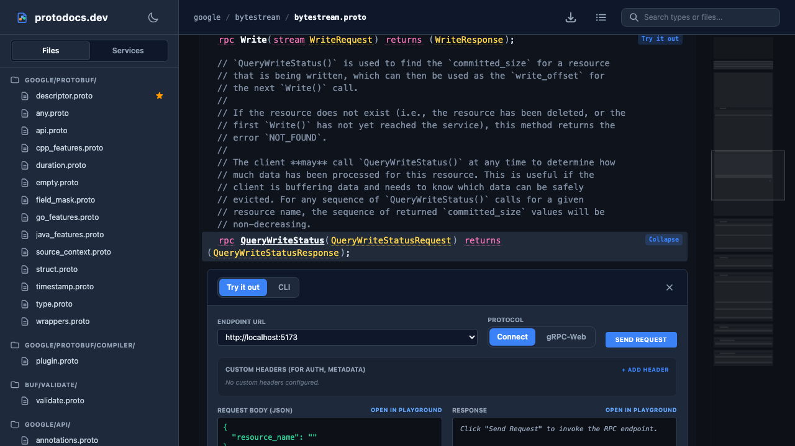
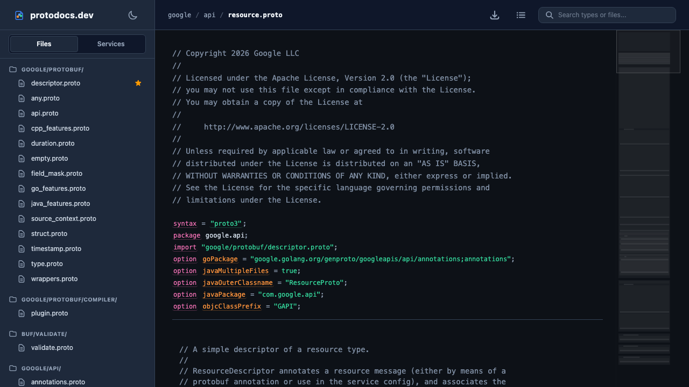
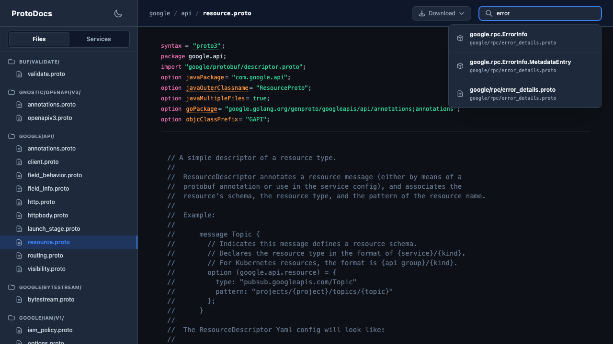
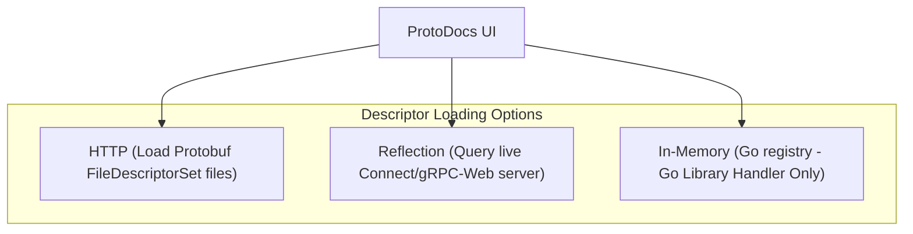
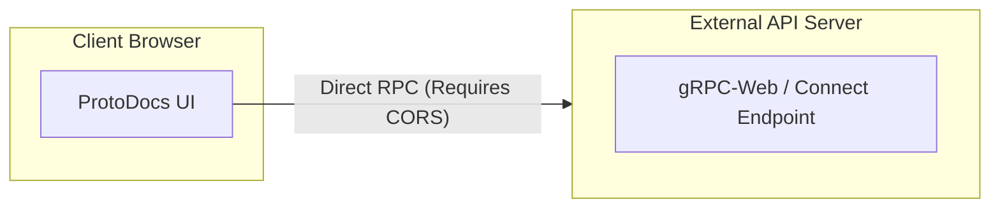
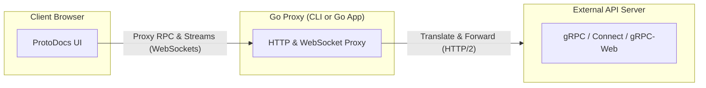

# protodoc

> [!CAUTION]
> This project is under active development and is not yet ready for use.
> There are many bugs and incomplete features.

**Try it live at [protodocs.dev](https://protodocs.dev/)!**

`protodoc` is a web-based documentation browser for Protocol Buffer definitions. It allows you to navigate through your `.proto` files, view message and service definitions, and understand the structure of your APIs.

## Features

*   Browse a list of packages
*   View detailed information about messages and services
*   See the source code of your `.proto` files
*   Expandable and collapsible sections for easy navigation
*   Render comments as markdown

### Screenshots

| Schema Loader |
| :---: |
|  |

| Message Detail | Service Detail (Try-it-now) |
| :---: | :---: |
|  |  |

| File Source (DSL) | Search Results |
| :---: | :---: |
|  |  |

### Architecture & Run Modes

ProtoDocs supports different deployment styles and routing options depending on your environment.

#### Descriptor Loading Strategies
To build the documentation UI, ProtoDocs needs access to your Protobuf descriptor schemas. It supports three strategies to load descriptors:

1. **HTTP Files**: Fetches pre-compiled Protobuf FileDescriptorSet files (typically `.binpb` or `.pb`) via HTTP.
2. **Server Reflection**: Queries schemas dynamically from a live target server using the Connect or gRPC-Web Reflection API.
3. **In-Memory Registry (Go Library Only)**: Reads descriptors directly from the Go application's schema registry (`protoregistry.GlobalFiles`). *Note: This option is only available when using the [Go Library Handler](./handler.go).*


```mermaid
graph TD
    UI["ProtoDocs UI"]

    subgraph Strategies["Descriptor Loading Options"]
        HTTP["HTTP (Load Protobuf FileDescriptorSet files)"]
        Reflect["Reflection (Query live Connect/gRPC-Web server)"]
        InMem["In-Memory (Go registry - Go Library Handler Only)"]
    end

    UI --> HTTP
    UI --> Reflect
    UI --> InMem
```

#### API Routing Modes
When using the interactive "Try it out" console to make API calls, ProtoDocs can route requests in two ways:

##### 1. Direct API Routing (Without Proxy)
The browser communicates directly with the target API server. This is the standard method for static website deployments.
> [!NOTE]
> Direct client-to-server requests require CORS to be configured and enabled on the target server.


```mermaid
graph LR
    subgraph Browser["Client Browser"]
        UI["ProtoDocs UI"]
    end
    subgraph Target["External API Server"]
        Service["gRPC-Web / Connect Endpoint"]
    end

    UI -->|"Direct RPC (Requires CORS)"| Target
```

##### 2. Proxied API Routing (With WS Proxy)
Browser requests and streaming calls (using WebSockets) are tunneled through the built-in HTTP/WS proxy (offered by the Go CLI or Go Library Handler), which forwards them to the target server.
> [!TIP]
> This mode avoids browser CORS issues completely and handles gRPC-Web/Connect translation under the hood.


```mermaid
graph LR
    subgraph Browser["Client Browser"]
        UI["ProtoDocs UI"]
    end
    subgraph GoProxy["Go Proxy (CLI or Go App)"]
        Proxy["HTTP & WebSocket Proxy"]
    end
    subgraph Target["External API Server"]
        Service["gRPC / Connect / gRPC-Web"]
    end

    UI -->|"Proxy RPC & Streams (WebSockets)"| Proxy
    Proxy -->|"Translate & Forward (HTTP/2)"| Target
```

---

## Usage Instructions

ProtoDocs can be deployed and run in several ways. Choose the method that best matches your architecture:

### 1. Desktop App
ProtoDocs is available as a native desktop app for macOS, Windows, and Linux from the [latest GitHub releases page](https://github.com/sudorandom/protodocs/releases/latest).

The desktop app is the easiest way to inspect local descriptor files without hosting anything. It includes the same interactive schema browser as the web UI, plus native file loading support for compiled descriptor sets (`.binpb` or `.pb`). You can also connect to live gRPC or Connect services with Server Reflection enabled.

After launching the app, use the schema loader to:
* Open or drag in compiled descriptor files.
* Connect to a reflection-enabled server.
* Load the built-in demo schema.

> [!NOTE]
> Desktop builds are not currently code-signed. Operating systems may show warnings or require an extra confirmation before opening the app. Preventing those warnings requires platform-specific signing and notarization.

### 2. Running with Go CLI
You can download the pre-built `protodocs` binary for your platform from the [latest GitHub releases page](https://github.com/sudorandom/protodocs/releases/latest).

On macOS or Linux, you can also install the latest release with Homebrew using the formula attached to each GitHub release:

```sh
brew install https://github.com/sudorandom/protodocs/releases/latest/download/protodocs.rb
```

Alternatively, you can run or install it directly using Go:

```sh
# Run directly without manual installation
go run github.com/sudorandom/protodocs/cmd/protodocs [options] [descriptor-files...]

# Or install it to your local environment
go install github.com/sudorandom/protodocs/cmd/protodocs@latest
```

Options include:
* `--addr`: Host/port to serve on (default: `127.0.0.1:8080`).
* `--reflection-url`: Server Reflection URL for dynamic schema queries.
* `--loading-method`: Fetch method (`http`, `grpc-web`, `connect`).
* `--open`: Auto-opens browser window (default: `true`).

If no options or descriptor files are supplied, the CLI automatically runs with demo settings loading the Eliza sample.

### 3. Embedded Go Library Handler
ProtoDocs can be imported as a library and mounted directly onto any Go HTTP server. 

A complete runnable example is available in the [examples/simple](./examples/simple) directory.

#### Installation
```sh
go get github.com/sudorandom/protodocs
```

#### Basic Example
Use `protodocs.NewHandler` with a `protodocs.Config`:

```go
package main

import (
	"log"
	"net/http"

	"github.com/sudorandom/protodocs"
	"google.golang.org/protobuf/reflect/protoregistry"
)

func main() {
	handler, err := protodocs.NewHandler(protodocs.Config{
		Title:    "My Service Documentation",
		LogoText: "My Service",
		Registry: protoregistry.GlobalFiles,
		Prefix:   "/docs/",
	})
	if err != nil {
		log.Fatalf("Failed to initialize ProtoDocs: %v", err)
	}

	http.Handle("/docs/", handler)

	log.Println("Serving docs at http://localhost:8080/docs/")
	if err := http.ListenAndServe(":8080", nil); err != nil {
		log.Fatal(err)
	}
}
```

#### Configuration Options
The `protodocs.Config` struct supports the following options:
* `Title` / `LogoText` / `LogoURL`: Customize browser tab title and sidebar brand logo.
* `LoadingMethod`: Default fetching method (`"http"`, `"grpc-web"`, or `"connect"`).
* `DescriptorFiles`: URLs or paths to load pre-compiled protobuf descriptor sets.
* `ServerURL` / `ReflectionURL`: Default endpoint URLs for RPC requests and reflection.
* `Prefix`: The URL path prefix under which the handler is hosted (e.g. `"/docs/"`).
* `Descriptors`: In-memory `*descriptorpb.FileDescriptorSet` served at `/descriptors.binpb`.
* `Registry`: Dynamic `*protoregistry.Files` registry.
* `FrontPageSections`: Ordered front page sections (`"markdown"`, `"markdown-small"`, `"descriptor-stats-panel"`, or `"service-list-panel"`).
* `BackToText` / `BackToURL`: Header link back to your main portal.
* `DefaultTab`: Default tab to focus in the sidebar (`"files"` or `"services"`).

---

### 4. Static Website Distribution & Configuration
ProtoDocs runs entirely as a client-side static web application. You can download the pre-packaged static archive (`protodocs-static.tar.gz`) containing the HTML/JS bundle directly from the [latest GitHub releases page](https://github.com/sudorandom/protodocs/releases/latest).

Extract this archive on your web host (such as Nginx, Apache, S3, Netlify, or GitHub Pages) to host your documentation.

#### Configuring the Static UI
To customize the static site without recompiling any source code, modify the following files in the extracted web root:
1. **[config.yaml](./public/config.yaml)**: Defines all configuration options.
2. **Protobuf descriptor files**: Upload your compiled `.binpb` or `.pb` files to the web root.

Example `config.yaml`:
```yaml
title: "My API Docs"
logo_text: "My API Docs"
logo_url: "/custom-logo.svg"
default_tab: "files"
loading_method: "http"
descriptor_files:
  - "/my-descriptors.binpb"
server_url: "http://127.0.0.1"
default_file: "my-app/v1/service.proto"
front_page_sections:
  - type: markdown
    markdown: |
      # Welcome
      This is the front page.
  - type: descriptor-stats-panel
  - type: service-list-panel
  - type: markdown-small
    markdown: |
      # Footer
      This is the footer.
```

---

### 5. Running with Docker

#### Running the Pre-built Image
```sh
docker run -d -p 8080:80 sudorandom/protodocs:latest
```
Open `http://localhost:8080` to view the UI.

#### Mounting Custom Descriptors at Runtime
First, generate a descriptor set from your `.proto` files using `buf` or `protoc`:
```sh
# Using buf:
buf build -o my-descriptors.binpb

# Or using protoc:
protoc --descriptor_set_out=my-descriptors.binpb --include_imports your_file.proto
```

Run the container, mounting your custom descriptors:
```sh
docker run -d -p 8080:80 \
  -v $(pwd)/my-descriptors.binpb:/usr/share/nginx/html/custom.binpb \
  sudorandom/protodocs:latest
```
Access in browser: `http://localhost:8080/?descriptors=/custom.binpb`

#### Building the Docker Image Locally
```sh
pnpm build
docker build -t protodocs .
docker run -d -p 8080:80 protodocs
```

---

## Development Information

### Local Dependencies with `mise`
Local tool and SDK dependencies (such as Go, Node.js, pnpm, and buf) are declared and pinned in [mise.toml](./mise.toml). Using [mise](https://mise.jdx.co/) is the recommended way to keep your environment aligned.

To set up the development environment:
1. Install [mise](https://mise.jdx.co/).
2. Run `mise install` in the root of the project.
3. Verify the tools are loaded (e.g., `go version`, `node --version`, `pnpm --version`).

### Task Runner (`just`)
We use [just](https://github.com/casey/just) for automating project tasks. Check the tasks defined in [justfile](./justfile):

*   **`just run-cli [args]`**: Builds the frontend files and executes the Go CLI backend.
*   **`just test`**: Runs all unit tests (frontend via `vitest`). Go backend tests can be run using `go test ./...`.
*   **`just lint`**: Runs TypeScript compilation checks, ESLint, and `golangci-lint`.
*   **`just playwright`**: Runs Playwright E2E browser tests and generates screenshots.
*   **`just descriptors`**: Re-generates standard Protobuf descriptor binaries in the `public/` directory (e.g., googleapis, protovalidate, eliza).
*   **`just package`**: Generates a clean production bundle and packages it as `protodocs-static.tar.gz`.
*   **`just build-cli`**: Compiles the Go CLI for multiple targets (`linux-amd64`, `linux-arm64`, `darwin-amd64`, `darwin-arm64`, `windows-amd64`).

---

## Contributing

Contributions are what make the open source community such an amazing place to learn, inspire, and create. Any contributions you make are **greatly appreciated**.

If you have a suggestion that would make this better, please fork the repo and create a pull request. You can also simply open an issue with the tag "enhancement".

Don't forget to give the project a star! Thanks again!

1.  Fork the Project
2.  Create your Feature Branch (`git checkout -b feature/AmazingFeature`)
3.  Commit your Changes (`git commit -m 'Add some AmazingFeature'`)
4.  Push to the Branch (`git push origin feature/AmazingFeature`)
5.  Open a Pull Request
