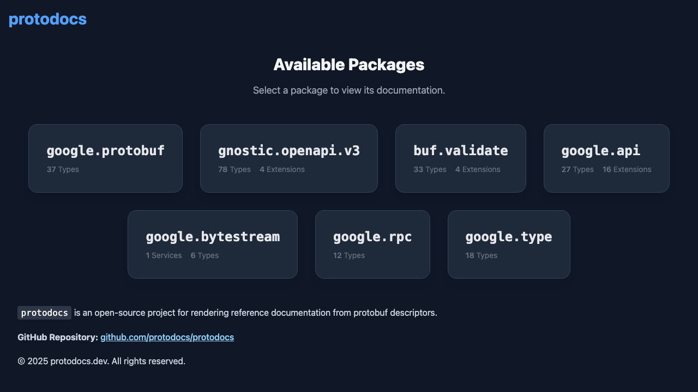
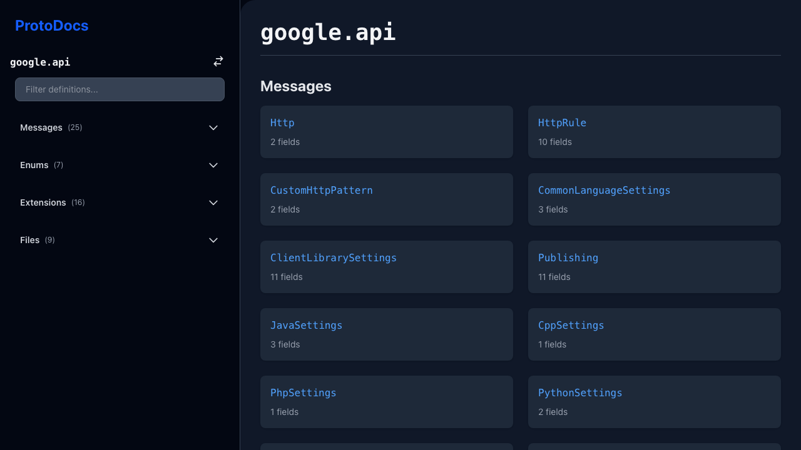
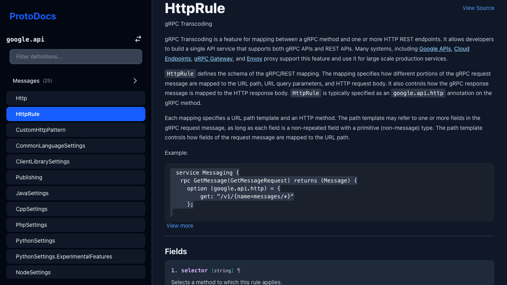
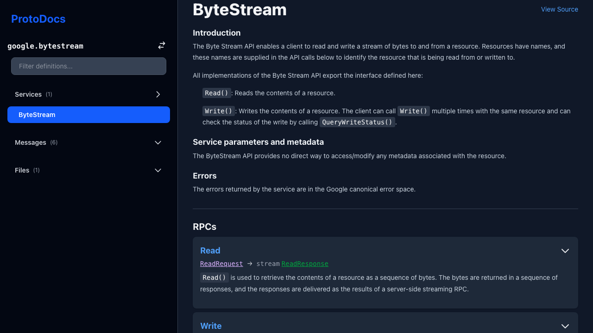
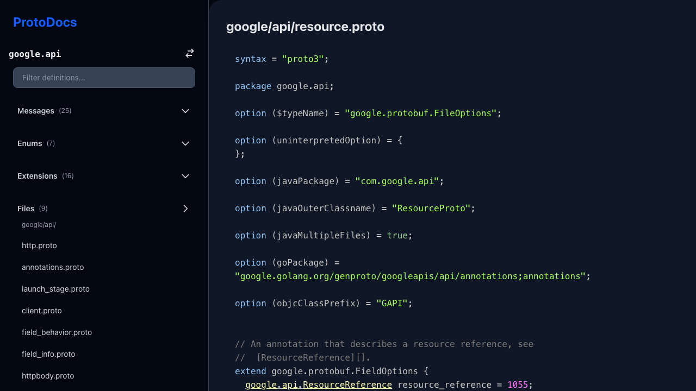

# ProtoDoc

> [!CAUTION]
> This project is under active development and is not yet ready for use.
> There are many bugs and incomplete features.

ProtoDoc is a web-based documentation browser for Protocol Buffer definitions. It allows you to navigate through your `.proto` files, view message and service definitions, and understand the structure of your APIs.

## Features

*   Browse a list of packages
*   View detailed information about messages and services
*   See the source code of your `.proto` files
*   Expandable and collapsible sections for easy navigation
*   Render comments as markdown

## Screenshots

| Package List | Package Index | Message Detail |
| :---: | :---: | :---: |
|  |  |  |

| Service Detail | File Source |
| :---: | :---: |
|  |  |

## Getting Started

To get a local copy up and running, follow these simple steps.

### Prerequisites

*   [Node.js](https://nodejs.org/en/) (v20 or later)
*   [pnpm](https://pnpm.io/)

### Installation

1.  Clone the repo
    ```sh
    git clone https://github.com/your_username/protodoc.git
    ```
2.  Install NPM packages
    ```sh
    pnpm install
    ```

### Usage

To start the development server, run:

```sh
pnpm dev
```

This will open a browser window with the application running on `http://localhost:5173`.

To build the application for production, run:

```sh
pnpm build
```

This will create a `dist` directory with the production-ready files.

## Contributing

Contributions are what make the open source community such an amazing place to learn, inspire, and create. Any contributions you make are **greatly appreciated**.

If you have a suggestion that would make this better, please fork the repo and create a pull request. You can also simply open an issue with the tag "enhancement".

Don't forget to give the project a star! Thanks again!

1.  Fork the Project
2.  Create your Feature Branch (`git checkout -b feature/AmazingFeature`)
3.  Commit your Changes (`git commit -m 'Add some AmazingFeature'`)
4.  Push to the Branch (`git push origin feature/AmazingFeature`)
5.  Open a Pull Request
